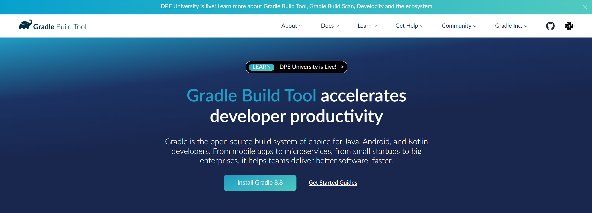
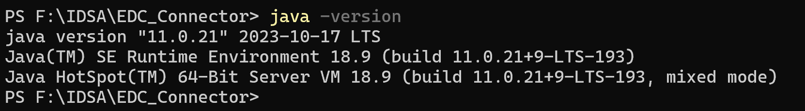
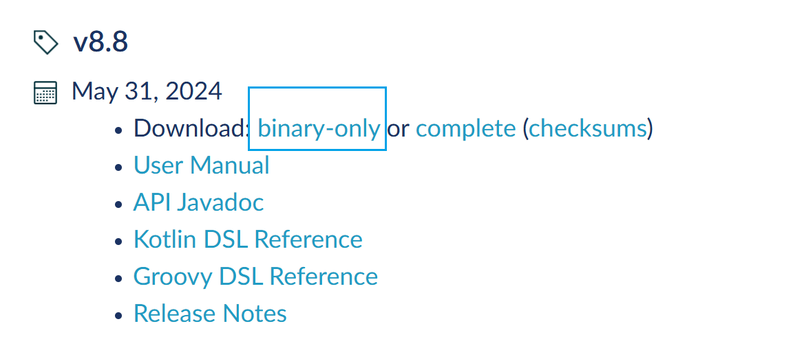
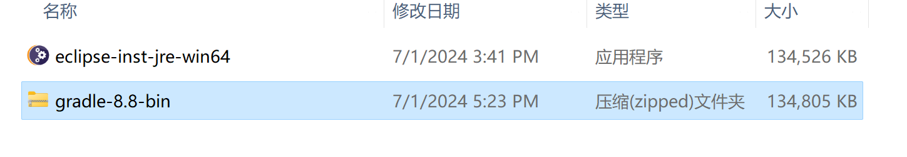
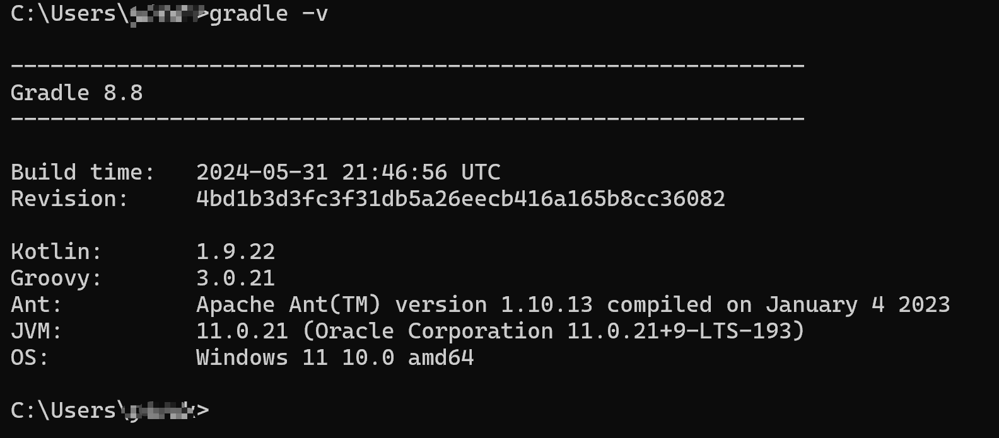

# Eclipse-Gradle 开发环境配置

## 安装Gradle

下载：[Gradle Build Tool](https://gradle.org/)

## 检查JDK是否安装，没有安装需要安装: JDK > version 8

## 安装 in Windows

### 下载链接

[Gradle | Releases](https://gradle.org/releases/)

### 选择合适版本

### 点击下载

## 解压到合适的目录下

1. 将解压目录路径添加到系统环境变量，并命名为：GRADLE_HOME；
2. 将 %GRADLE\_HOME%\\bin 添加到系统变量 Path中。

## 重启系统-检测

---
