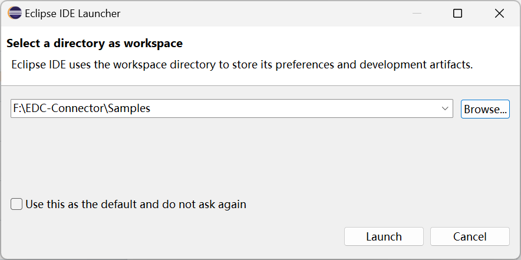

# EDC Connector Sample 下载安装与运行教程

## 源项目网址

[Samples](https://github.com/eclipse-edc/Samples)

[eclipse-edc/Samples (github.com)](https://github.com/eclipse-edc/Samples)

## 项目快照


## 下载

命令：

```cmd
git clone https://github.com/eclipse-edc/Samples.git
```

使用IDEA Terminal 下载：


## 项目展示


## 项目结构分析

### basic 目录


1. basic/basic-01-basic-connector 目录下没有源代码；
2. basic/basic-02-health-endpoint 目录下有源代码：该子项目用 Eclipse开发；
3. basic/basic-03-configuration 目录下有源代码：该子项目用Eclipse开发。

总结：除了这三个子项目，整个Connector项目的其他项目大都是使用Eclipse开发的。

---

因此，建议使用 Eclipse进行初步开发。

## 下载安装 Eclipse

### 下载官网：[Eclipse Downloads | The Eclipse Foundation](https://www.eclipse.org/downloads/)

### 安装完成后


---

## git clone EDC Connector

为了避免IDEA组件的影响，重新git clone https://github.com/eclipse-edc/Samples.git.


## 使用Eclipse打开项目





## 点击File->切换工作空间


1


--
