# 通过Gradle 构建编译 EDC Connector

## EDC Connector Sample

该项目是一个实例项目，本次测试运行基于该项目。

项目地址：[eclipse-edc/Samples (github.com)](https://github.com/eclipse-edc/Samples/tree/main)   [Samples](https://github.com/eclipse-edc/Samples)

## 使用命令 ./gradlew -v 查看该项目使用的 Gradle版本相关信息

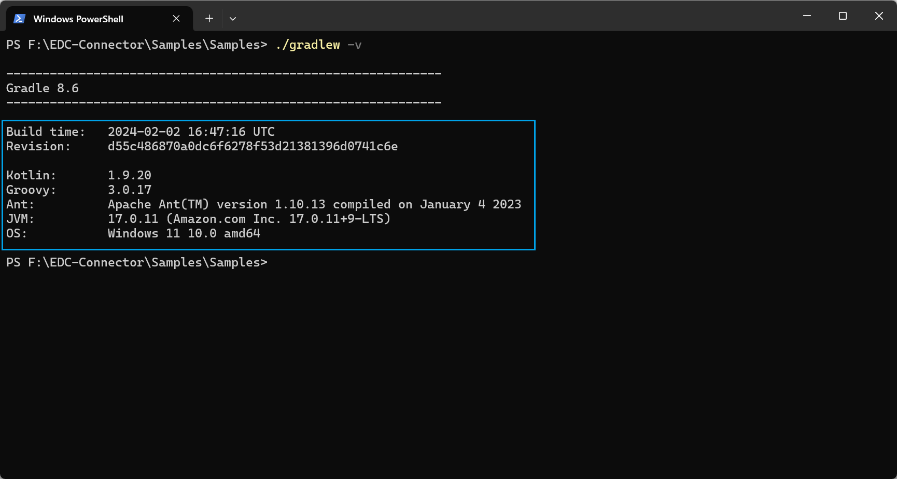

使用:

1. Groovy版本：3.0.17
2. Kotlin版本：1.9.20
3. 基于Windows环境开发
4. 编译时间为：2024-02-02

## 运行 gradle init 初始化

```gradle
gradle init
```

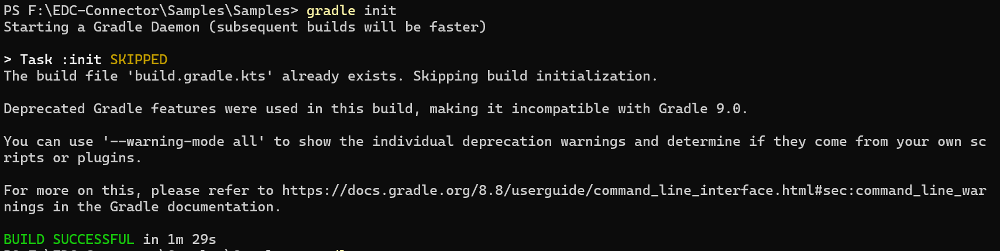

成功运行。

## 运行 gradle run 运行项目

````gradle
gradle run
````

### 出现警告提示：

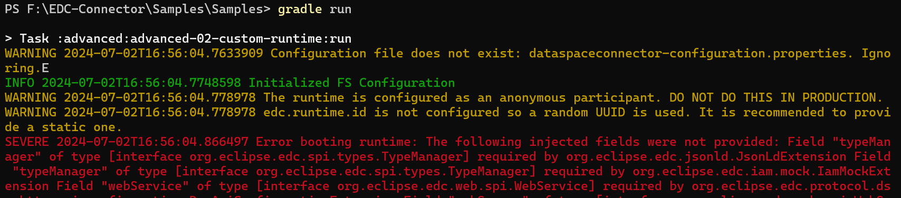

### 继续运行，运行失败


分析：可能是Gradle版本不对应的问题。

本机安装Gradle为：Gradle v8.8

## 测试EDC Connector项目使用的Gradle版本

控制台输入命令：

````cmd
gradle -v
````

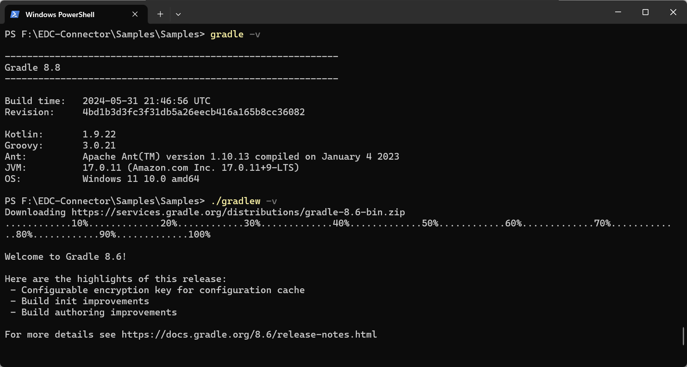

首先显示输出的是：Gradle 8.8。

说明：当前计算机大环境安装的是 Gradle 8.8。

控制台输入命令：

````cmd
./gradlew -v
````

输出：正在下载：Gradle 8.6。

说明EDC Connector 项目使用的是Gradle 8.6，并自动执行下载。

再次控制台输入命令：

````cmd
gradle -v
````

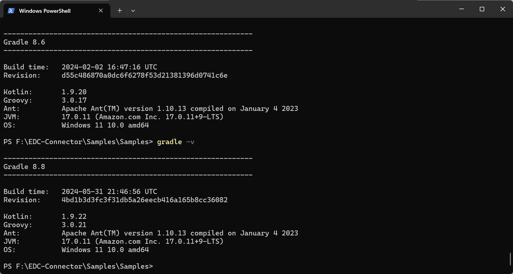

仍然显示 Gradle 8.8，说明有可能没有配置 Gradle 8.6。

再次控制台输入命令：

````cmd
./gradlew -v
````

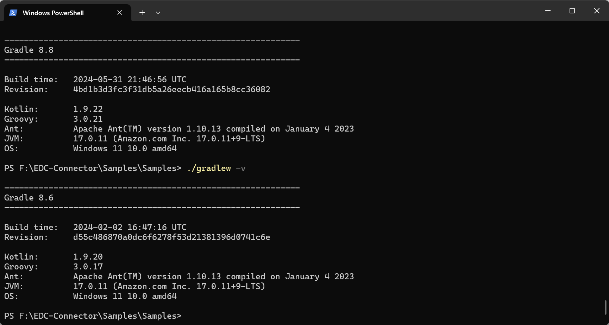

没有下载直接显示 Gradle 8.6。

#### 再次输入 gradle run运行：

```gradle
gradle run
```

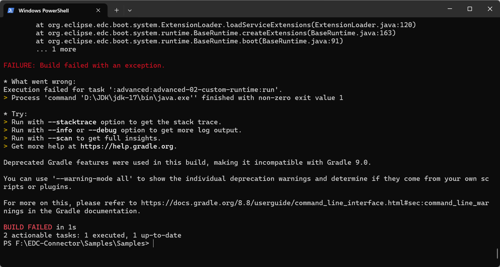

说明全局的Gradle仍然是 Gradle 8.8.

#### 修改后输入 ./gradlew run运行：

```gradle
./gradlew run
```

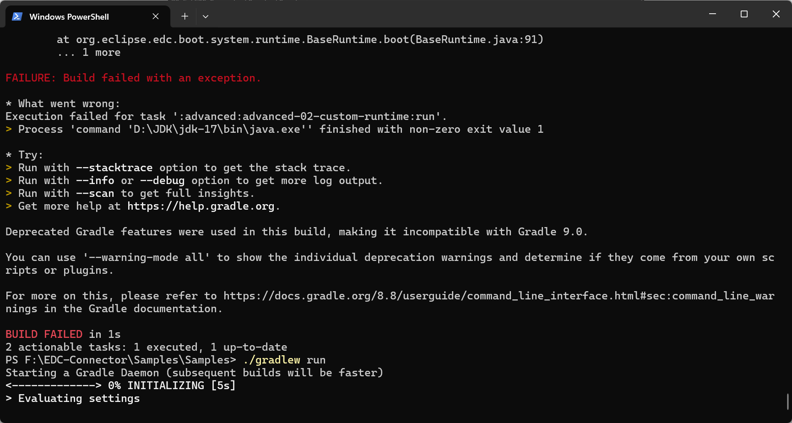

输出：


说明命令 ./gradlew run 无法运行本地 Gradle 8.6 运行项目。

## 使用命令 ./gradlew clean build 进行清理构建

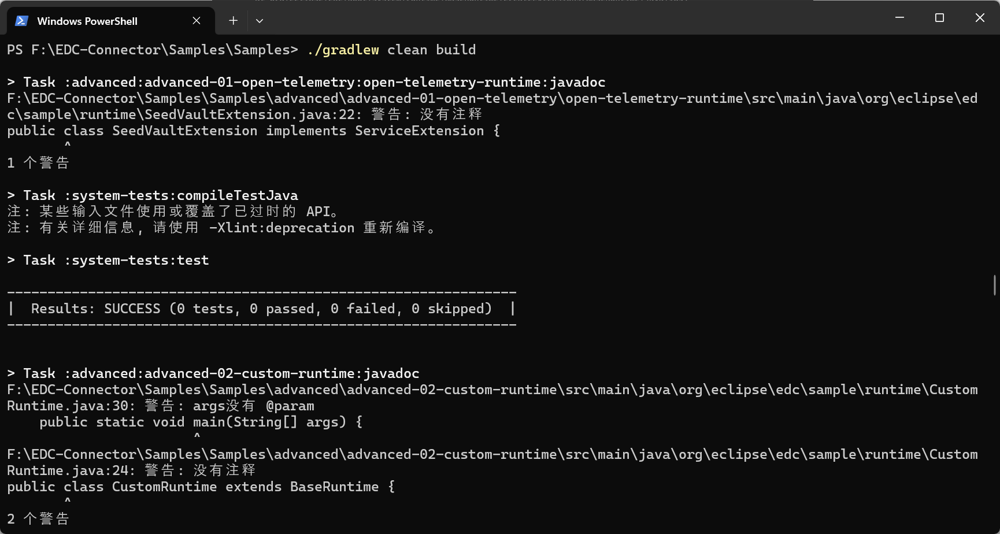

提示：EDC Connector项目有些API的写法已经被弃用或过时。

### 下面逐个分析gradle构建任务的细节

#### task 1:

> Task :advanced:advanced-01-open-telemetry:open-telemetry-runtime:javadoc


显示没有注释，影响较小。

#### task 2: Task :system-tests:test

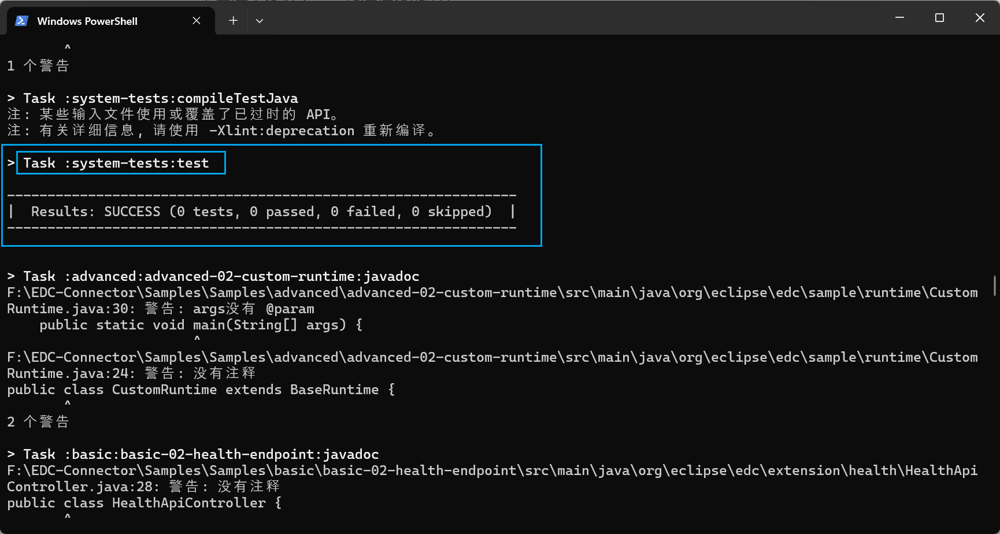

这个任务的构建没有错误和警告。

#### task 3:

Task :advanced:advanced-02-custom-runtime:javadoc

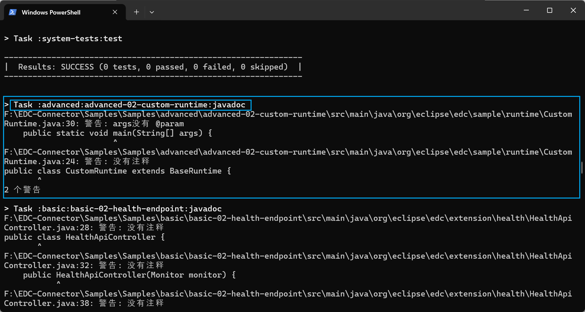

主要问题是没有注释，触发警告提示。

#### task 4:

Task :basic:basic-02-health-endpoint:javadoc

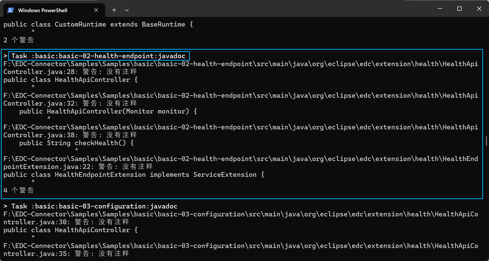

主要问题是没有注释，触发警告提示。

#### task 5:

Task :basic:basic-03-configuration:javadoc

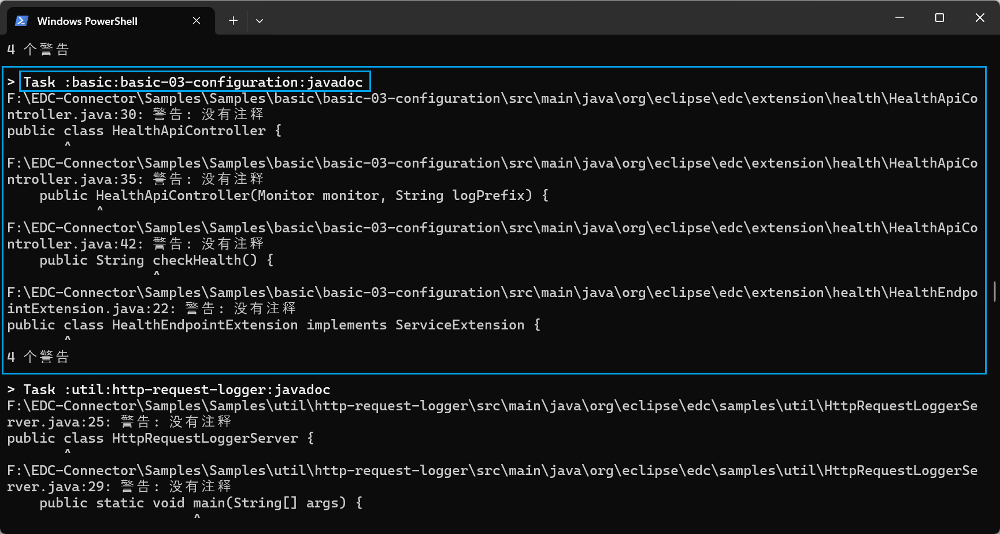

主要问题是没有注释，触发警告提示。

#### task 6:

Task :util:http-request-logger:javadoc

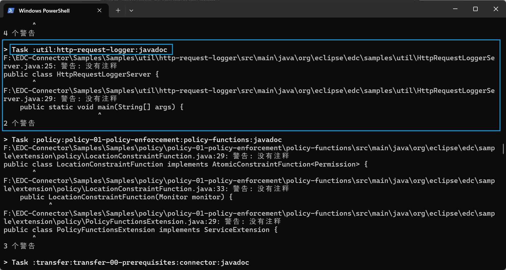

主要问题是没有注释，触发警告提示。

#### task 7:

Task :policy:policy-01-policy-enforcement:policy-functions:javadoc

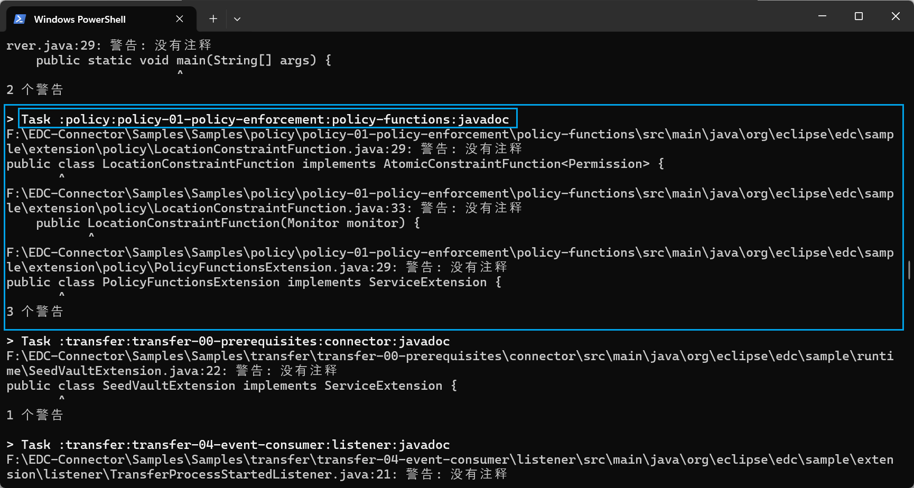

#### task 8:

Task :transfer:transfer-00-prerequisites:connector:javadoc

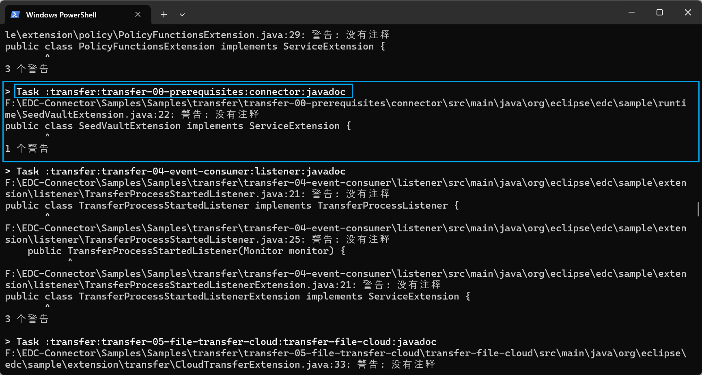

#### task 9:

Task :transfer:transfer-04-event-consumer:listener:javadoc

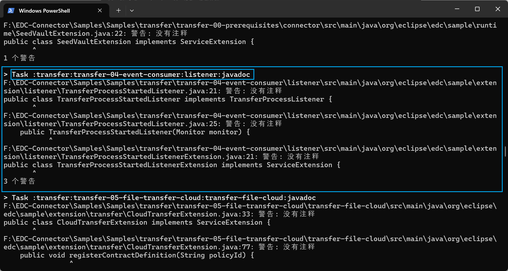

#### task 10:

Task :transfer:transfer-05-file-transfer-cloud:transfer-file-cloud:javadoc

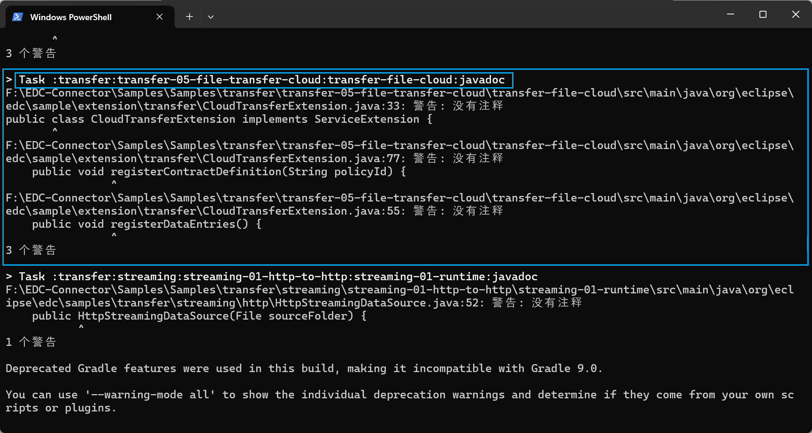

#### task 11:

Task :transfer:streaming:streaming-01-http-to-http:streaming-01-runtime:javadoc

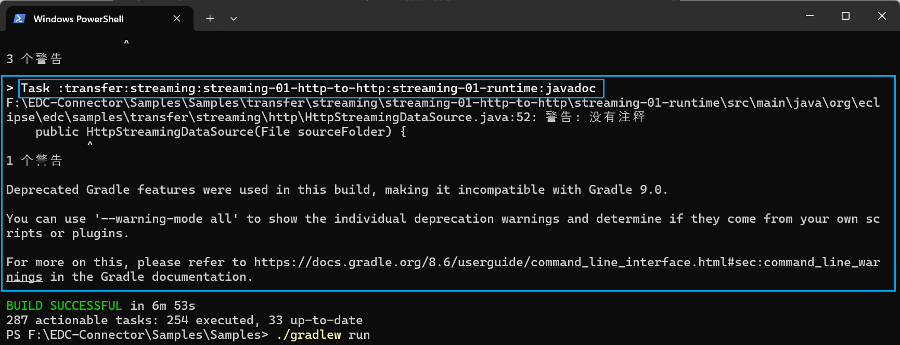

### 总结

经过11个子任务的构建后，./gradlew clean build 命令成功运行，构建成功。

## 再次使用：./gradlew clean build 编译构建

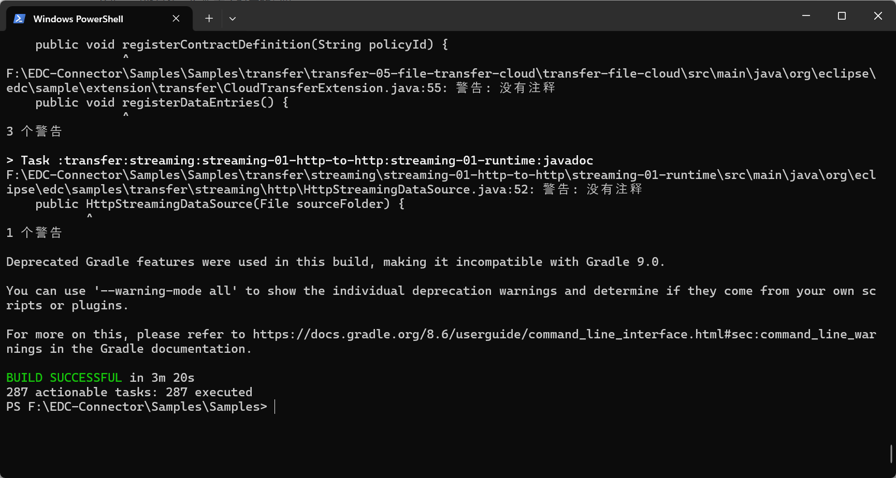

仍然是输出警告，但是编译构建成功。

---
