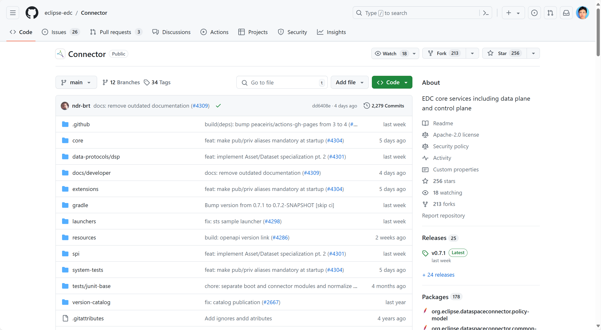
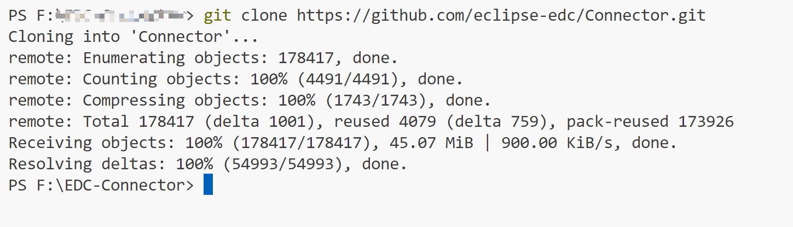
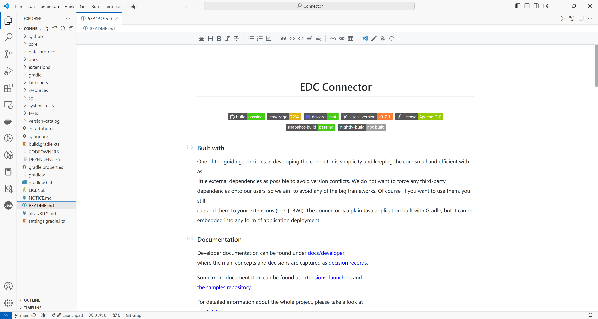
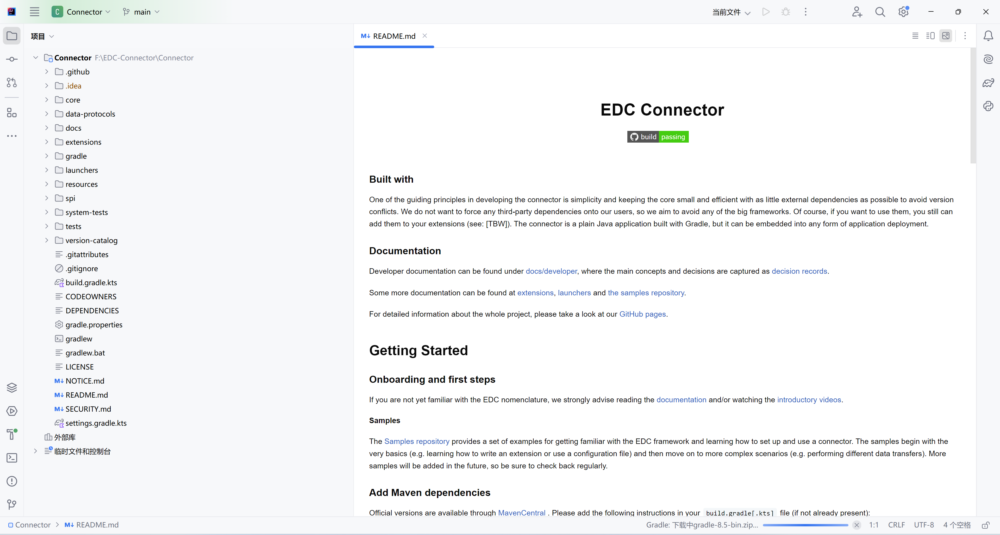
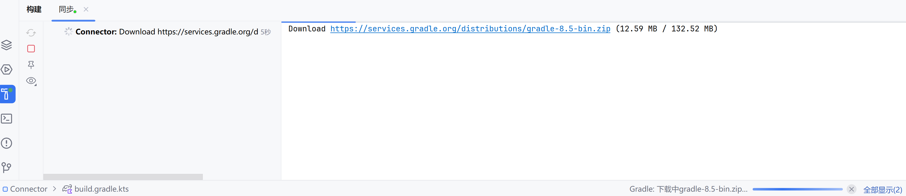

# EDC Connector 下载安装与运行教程

## 源项目网址

[Connector](https://github.com/eclipse-edc/Connector)

[eclipse-edc/Connector: EDC core services including data plane and control plane (github.com)](https://github.com/eclipse-edc/Connector)

## 项目快照



## 下载

命令：

```cmd
git clone https://github.com/eclipse-edc/Connector.git
```



## cd 打开项目所在文件目录

使用IDE: VS Code



使用：IDEA



---

下面讲解都基于 IDEA：


详细信息：

IntelliJ IDEA 2024.1.3 (Community Edition)
Build #IC-241.17890.1, built on June 4, 2024
Runtime version: 17.0.11+1-b1207.24 amd64
VM: OpenJDK 64-Bit Server VM by JetBrains s.r.o.
Windows 11.0
GC: G1 Young Generation, G1 Old Generation
Memory: 4064M
Cores: 32
Registry:
ide.experimental.ui=true
Non-Bundled Plugins:
com.intellij.zh (241.271)
PythonCore (241.17890.1)
com.intellij.plugins.vscodekeymap (241.14494.150)
Docker (241.17890.14)
Kotlin: 241.17890.1-IJ

## 首次打开

### 打开配置文件：build.gradle.kts

显示


点击：加载脚本配置



